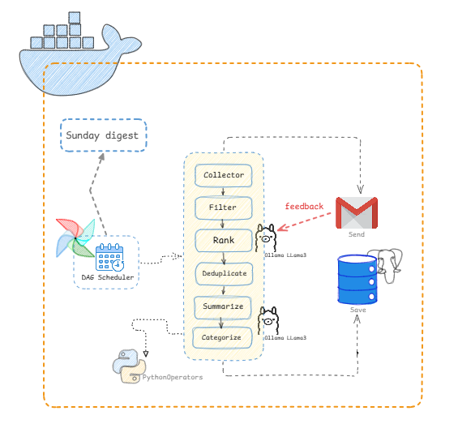
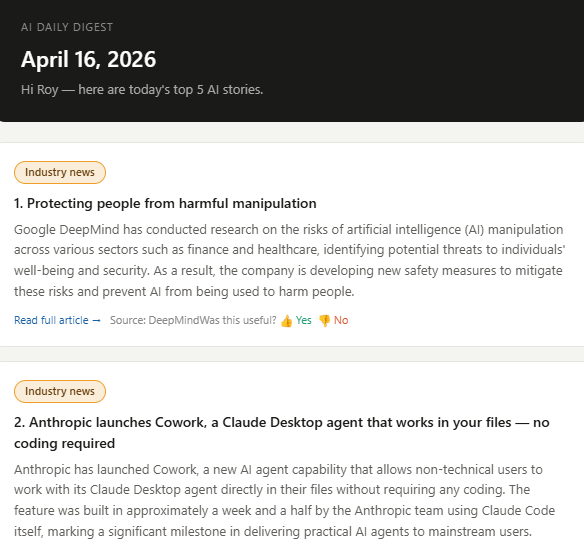
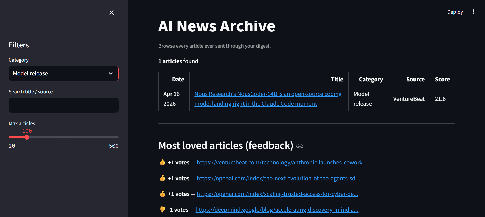

# AI Newsletter Agent 🤖📰

A fully automated, end-to-end AI news aggregation pipeline. 

This agent wakes up every day to scrape the internet for the most cutting-edge AI news, uses local LLMs to read and rank their importance, synthesizes summaries, and delivers a personalized daily and weekly HTML digest straight to your email inbox.
  
### Preview

   
  Workflow

  

   
  Outcome: Email Snapshot

  

   
  Monitoring: Streamlit Dashboard

  

### 🌟 Key Features
- **Broad Intel Gathering:** Pulls real-time data from 50+ RSS feeds (OpenAI, DeepMind, Anthropic), arXiv API, Reddit APIs, and trending GitHub repos.
- **Local AI Evaluator:** Uses **Ollama (Llama 3)** running locally to independently read, score, and evaluate every article out of 10 to cut out the noise.
- **Automated Summarization:** Pushes the top trending articles back through Llama 3 to generate small summaries and categorical tags.
- **Personalized Delivery:** Maintains recipient profiles via PostgreSQL. 
- **Human-in-the-Loop Feedback:** A native Flask web-hook embedded in the email allows you to click 👍/👎 on stories, sending signals back to the database for ML-driven preference weighting.
- **Full Automation:** Orchestrated by Apache Airflow running in Docker.

### 🛠️ Architecture Stack
- **Orchestration:** Apache Airflow (Dockerized)
- **AI Backend:** Ollama (Llama 3, running natively)
- **Database:** PostgreSQL (Containerized)
- **Email Delivery:** Python `smtplib` -> Gmail SMTP
- **Web Dashboards:** Streamlit (Archive Viewer) & Flask (Feedback Server)

   
  Architecture of the workflow

**Read the `SETUP.md` for specific instructions on how to replicate and run this system locally.**

## 💡 Use Cases

This agent is highly configurable and can be adapted far beyond just AI news. Here are a few ways it can be utilized:

* **Accelerated Learning for Newcomers:** In the rapidly changing landscape of AI, it is incredibly easy to miss out on critical updates. People who are new to AI can use this agent to gain easily digestible, high-signal information daily, allowing them to rapidly upgrade their skills and stay relevant in the tech world.
* **Personalized Daily Briefings:** Save hours of doom-scrolling by receiving a curated, distraction-free email every morning containing only the top 5 highest-quality breakthroughs in your field. 
* **Team Knowledge Sharing:** Deploy the agent for your startup or research lab. Engineers and researchers can subscribe with their specific interests (e.g., "robotics", "open-source LLMs") and automatically receive a team-wide newsletter without manual curation.
* **Niche Academic Monitoring:** Configure the agent to monitor specific arXiv categories and academic subreddits. It will automatically filter out the noise and deliver high-impact research papers right to your inbox with condensed, easy-to-read summaries.
* **Content Curation for Creators:** If you run an industry newsletter or social media channel, use the agent as an automated research assistant to discover, categorize, and draft summaries for the content you plan to publish.

## Author
Copyright (c) 2026 Misty Roy
  
Linkedin: https://www.linkedin.com/in/misty-roy-74ab48199/
