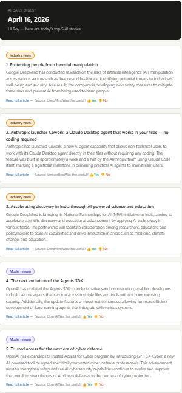
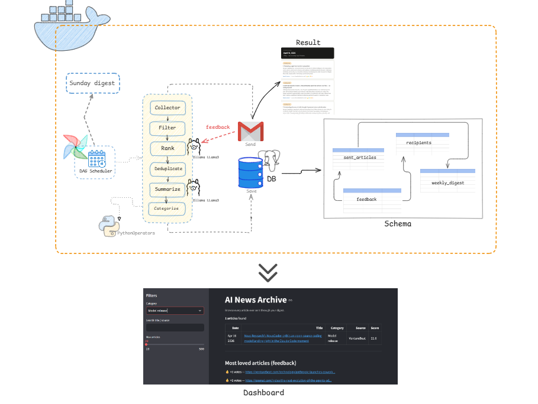

# AI Newsletter Agent 🤖📰

A fully automated, end-to-end AI news aggregation pipeline. 

This agent wakes up every day to scrape the internet for the most cutting-edge AI news, uses local LLMs to read and rank their importance, synthesizes summaries, and delivers a personalized daily and weekly HTML digest straight to your email inbox.
  
### Preview

   
  Outcome: Email Snapshot

  

  

### 🌟 Key Features
- **Broad Intel Gathering:** Pulls real-time data from 50+ RSS feeds (OpenAI, DeepMind, Anthropic), arXiv API, Reddit APIs, and trending GitHub repos.
- **Local AI Evaluator:** Uses **Ollama (Llama 3)** running locally to independently read, score, and evaluate every article out of 10 to cut out the noise.
- **Automated Summarization:** Pushes the top trending articles back through Llama 3 to generate small summaries and categorical tags.
- **Personalized Delivery:** Maintains recipient profiles via PostgreSQL. 
- **Human-in-the-Loop Feedback:** A native Flask web-hook embedded in the email allows you to click 👍/👎 on stories, sending signals back to the database for ML-driven preference weighting.
- **Full Automation:** Orchestrated by Apache Airflow running in Docker.

### 🛠️ Architecture Stack
- **Orchestration:** Apache Airflow (Dockerized)
- **AI Backend:** Ollama (Llama 3, running natively)
- **Database:** PostgreSQL (Containerized)
- **Email Delivery:** Python `smtplib` -> Gmail SMTP
- **Web Dashboards:** Streamlit (Archive Viewer) & Flask (Feedback Server)

Read the `SETUP.md` for specific instructions on how to replicate and run this system locally.
